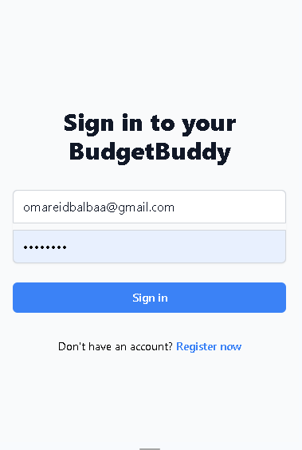

# BudgetBuddy

A responsive personal expense tracking application to help you manage your finances.


## Features

- User authentication (login/register)
- Add, Edit and track expenses
- Filter expenses by category and date range
- Monthly expense reports
- Responsive design for mobile and desktop

## Total hours spent

11 hours


## Screenshots

### Login Page


### Register Page


### Dashboard


## Technologies Used

- Frontend:
  - React
  - Tailwind CSS
  - Axios
  - React Router

- Backend:
  - Node.js
  - Express
  - MySQL
  - Sequelize
  - JWT Authentication

## Setup

1. Clone the repository
2. Install dependencies for both frontend and backend:
```bash
cd budgetbuddy-frontend
npm install

cd ../budgetbuddy-api
npm install
```

3. Configure environment variables

4. Run the application:
```bash
# Terminal 1 - Frontend
cd budgetbuddy-frontend
npm run dev

# Terminal 2 - Backend
cd budgetbuddy-api
node app.js
```